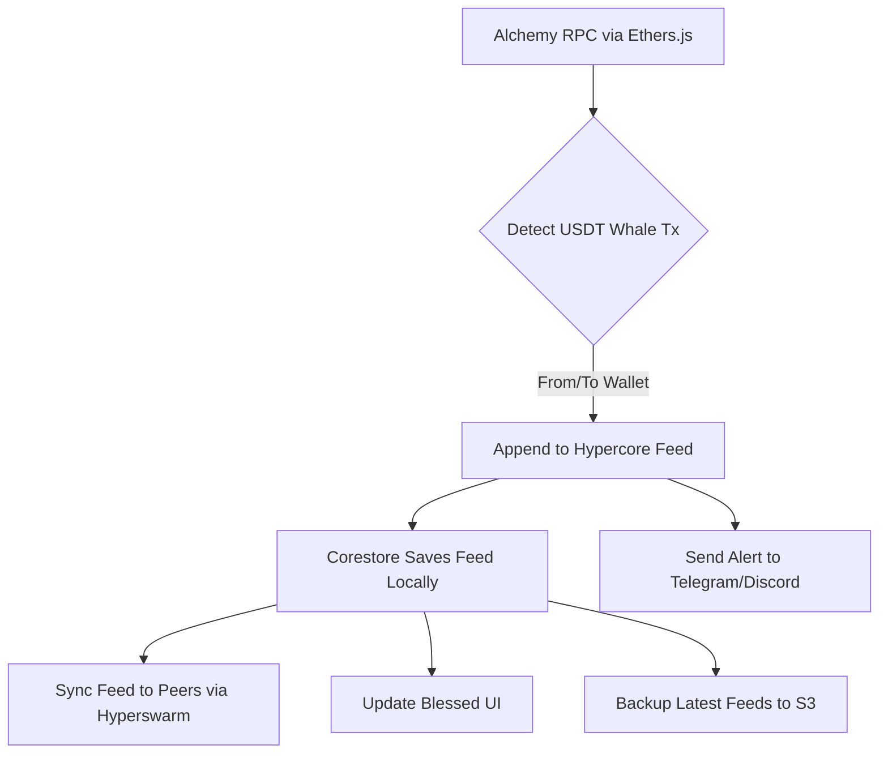
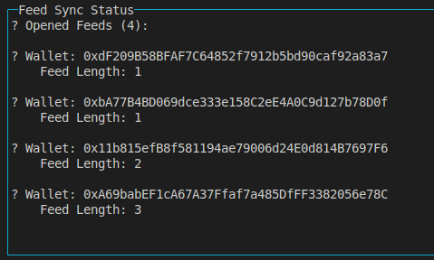

# 🐋 Hyperswarm USDT Whale Monitoring System

A fully decentralized, multi-node USDT whale transfer tracker built using the **Pears Stack** (Hypercore + Hyperswarm + Corestore). Real-time alerts, peer-to-peer syncing, and automatic S3 backups included.

---

## 🚀 Features

* Tracks **high-value USDT transfers** on Ethereum mainnet in real-time
* Creates **wallet-specific Hypercore feeds** for immutable event logging
* Uses **Hyperswarm** for peer-to-peer replication across nodes
* Supports **multiple feeds** with **Corestore**
* Live terminal dashboard powered by **Blessed**
* Sends notifications via **Telegram** and **Discord**
* Automatically backs up latest 5 feeds to **Amazon S3**
* Ready for deployment on **Render**, **EC2**, or any VPS

---

## 🧱 Architecture Overview

| Module         | Role                                           |
| -------------- | ---------------------------------------------- |
| **Hypercore**  | Append-only, per-wallet transaction logs       |
| **Corestore**  | Organizes and manages multiple Hypercore feeds |
| **Hyperswarm** | Peer-to-peer pub-sub layer for replication     |
| **Ethers.js**  | Ethereum RPC client to watch USDT events       |
| **AWS SDK v3** | Uploads feeds to S3                            |
| **Blessed**    | Terminal UI for monitoring peers + logs        |
| **dotenv**     | Manages environment variables                  |

---

## ⚙️ Getting Started

### 1. Clone the Repository

```bash
git clone https://github.com/yourname/hyperswarm-whale-monitor.git
cd hyperswarm-whale-monitor
```

### 2. Install Dependencies

```bash
npm install
```

### 3. Set up `.env`

Create a `.env` file and populate it with:

```env
ALCHEMY_URL=https://eth-mainnet.g.alchemy.com/v2/YOUR_KEY
TELEGRAM_BOT_TOKEN=your_telegram_token
TELEGRAM_CHAT_ID=your_chat_id
DISCORD_WEBHOOK_URL=your_webhook
S3_BUCKET_NAME=my-hypercore-backup
AWS_REGION=ap-south-1
AWS_ACCESS_KEY_ID=your_access_key
AWS_SECRET_ACCESS_KEY=your_secret_key
```

### 4. Run the Node

```bash
npm start
```

Your node will:

* Monitor Ethereum for USDT whale transfers
* Append logs to per-wallet Hypercore feeds
* Sync logs across nodes using Hyperswarm
* Display live dashboard of feeds and peers
* Trigger alerts via Telegram and Discord

---

## 📁 Project Structure

```
/feeds               # Corestore storage (wallet logs)
/utils               # Core logic: watchers, alerts, feed utils
/scripts             # CLI tools for inspecting & backing up feeds
startNode.js         # Main entry point
.env                 # Environment configuration
```

---

## 🧼 Available Scripts

### 🔍 View Logs for a Wallet

```bash
node scripts/showWalletLogs.js <wallet-address>
```

### ☁️ Backup Feeds to S3

```bash
node scripts/backupFeeds.js
```

---

## 🔁 Multi-Node Deployment (Recommended)

Deploy 3+ nodes on platforms like Render, EC2, or any VPS:

* All nodes use the same topic (derived from the USDT contract)
* Each node monitors USDT transfers and writes to local feeds
* Nodes auto-sync via Hyperswarm
* S3 backup ensures durability and archiving

---

## 📊 Key Terms

| Term            | Description                            |
| --------------- | -------------------------------------- |
| **Feed**        | Per-wallet log of whale USDT transfers |
| **Feed Length** | Number of events recorded in a feed    |
| **Corestore**   | Manages and indexes all feeds          |
| **Peer Sync**   | Automatic replication using Hyperswarm |

---

## 🔀 System Flow



---
## 🧠 Output

---
## 🧠 What this has

* **Real-time monitoring** of high-volume stablecoin activity
* **Peer-to-peer** infrastructure — no central server or DB required
* **Append-only log architecture** – perfect for auditability & forensics
* **Scales horizontally** with multiple nodes
* **S3 backups** for production-grade redundancy
* **Live dashboarding** built-in

---

## 🔮 Potential Enhancements

* ENS resolution for known wallets
* CSV/JSON export for analytics
* Visual dashboard for wallet clustering & graphing
* Multi-chain support: Polygon, Arbitrum, Tron
* Bridge detection and cross-chain alerts

---

## 🧠 Credits

Built with ❤️ by **coderRaj07** to showcase real-world, decentralized infra engineering and forward-thinking Web3 security teams.

---

